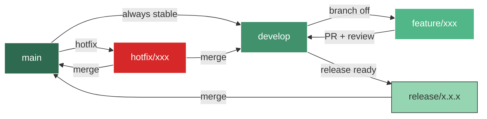

# 🔧 Contributing to ft_transcendence

Welcome to the team! This document explains how we work together — branching strategy, commit conventions, PR process, and code standards.

**Read this before writing any code.**

---

## 📋 Table of Contents

- [Getting Started](#getting-started)
- [Git Flow](#git-flow)
- [Branch Naming](#branch-naming)
- [Commit Convention](#commit-convention)
- [Pull Request Process](#pull-request-process)
- [Code Standards](#code-standards)
- [Code Review Guidelines](#code-review-guidelines)
- [Issue Workflow](#issue-workflow)
- [AI Transparency](#ai-transparency)

---

## Getting Started

```bash
# 1. Clone the repo
git clone git@github.com:Univers42/ft_transcendence.git
cd ft_transcendence

# 2. Set up your environment
cp .env.example .env
make

# 3. Create your feature branch FROM develop
git checkout develop
git pull origin develop
git checkout -b feature/your-feature-name
```

---

## Git Flow

We use **Git Flow** — a structured branching model that keeps `main` stable and `develop` as the integration branch.



### Branch Rules

| Branch | Purpose | Merge Target | Protected |
|--------|---------|-------------|-----------|
| `main` | Production-ready code | — | ✅ No direct push |
| `develop` | Integration branch | `main` (via release) | ✅ No direct push |
| `feature/*` | New features | `develop` (via PR) | ❌ |
| `fix/*` | Bug fixes | `develop` (via PR) | ❌ |
| `hotfix/*` | Critical production fixes | `main` + `develop` | ❌ |
| `release/*` | Release preparation | `main` + `develop` | ❌ |

### Golden Rules

1. **Never push directly to `main` or `develop`** — always go through a PR
2. **Always branch from `develop`** for features and fixes
3. **Keep branches short-lived** — merge within 2-3 days max
4. **Delete branches after merge** — keep the repo clean

---

## Branch Naming

```
<type>/<short-description>
```

| Type | When | Example |
|------|------|---------|
| `feature/` | New functionality | `feature/auth-oauth` |
| `fix/` | Bug fix | `fix/42-login-redirect` |
| `hotfix/` | Urgent production fix | `hotfix/cors-origin` |
| `release/` | Release prep | `release/1.0.0` |
| `docs/` | Documentation only | `docs/api-endpoints` |
| `refactor/` | Code improvement | `refactor/extract-guards` |
| `test/` | Adding tests | `test/auth-e2e` |

---

## Commit Convention

We follow [Conventional Commits](https://www.conventionalcommits.org/):

```
<type>(<scope>): <short description>

[optional body]

[optional footer]
```

### Types

| Type | Description |
|------|-------------|
| `feat` | New feature |
| `fix` | Bug fix |
| `docs` | Documentation only |
| `style` | Formatting, no logic change |
| `refactor` | Code change that neither fixes a bug nor adds a feature |
| `test` | Adding or updating tests |
| `chore` | Tooling, deps, CI, config |
| `perf` | Performance improvement |

### Examples

```bash
feat(auth): implement JWT refresh token rotation
fix(game): correct ball physics at high velocities
docs(readme): add environment variables section
refactor(users): extract profile validation to shared pipe
test(chat): add WebSocket connection E2E tests
chore(docker): upgrade PostgreSQL to 16.2
```

### Scope

Use the module name: `auth`, `users`, `game`, `chat`, `docker`, `ci`, `prisma`, etc.

---

## Pull Request Process

### Before Opening a PR

- [ ] Your branch is up to date with `develop` (`git rebase develop`)
- [ ] All tests pass locally (`make test`)
- [ ] Linter passes (`make lint`)
- [ ] TypeScript compiles with no errors (`make typecheck`)
- [ ] You've tested your feature manually

### PR Requirements

1. **Use the PR template** — it's auto-loaded when you open a PR
2. **Title follows commit convention** — e.g., `feat(auth): add Google OAuth login`
3. **Description explains what and why** — not just "fixed stuff"
4. **Link related issues** — `Closes #12` or `Related to #15`
5. **Screenshots/videos for UI changes** — before/after if applicable
6. **AI disclosure** — note if AI was used and for what

### Review Process

1. Open PR → Assign at least 1 reviewer (ideally 2)
2. CI runs automatically (lint + test + typecheck)
3. Reviewer approves or requests changes
4. Address all feedback
5. **Squash merge** into `develop`
6. Delete the source branch

### Review SLA

- Aim to review PRs within **24 hours**
- If you're blocked on a review, ping in Discord

---

## Code Standards

### TypeScript

- **Strict mode** — `strict: true` in all `tsconfig.json` files
- **No `any`** — use `unknown` and narrow with type guards
- **Explicit return types** on all functions
- **Interface over type** for object shapes (unless union/intersection needed)
- **Readonly where possible** — immutability by default

### Backend (NestJS)

- One module per feature domain (e.g., `auth.module.ts`, `users.module.ts`)
- DTOs for all request/response validation (with `class-validator`)
- Guards for authorization, Pipes for validation, Interceptors for transformation
- Services contain business logic, Controllers are thin
- All endpoints documented with `@ApiTags`, `@ApiOperation`, `@ApiResponse`

### Frontend (React)

- Functional components only (no class components)
- Custom hooks for reusable logic (`use*.ts`)
- Co-located tests (`Component.test.tsx` next to `Component.tsx`)
- Props interfaces named `ComponentNameProps`
- Lazy loading for route-level code splitting

### File Naming

| What | Convention | Example |
|------|-----------|---------|
| Components | PascalCase | `UserProfile.tsx` |
| Hooks | camelCase with `use` prefix | `useAuth.ts` |
| Services | camelCase | `auth.service.ts` |
| Modules | camelCase | `auth.module.ts` |
| Tests | Same name + `.spec.ts` / `.test.tsx` | `auth.service.spec.ts` |
| Types/Interfaces | PascalCase | `User.ts`, `AuthPayload.ts` |

---

## Code Review Guidelines

### For Reviewers

- **Be kind, be specific** — "This could cause a race condition because…" not "This is wrong"
- **Suggest, don't demand** — "Consider using X here because…"
- **Approve if it's good enough** — perfect is the enemy of shipped
- **Test the branch locally** if the change is significant
- **Check for**: security issues, missing tests, broken types, naming, edge cases

### For Authors

- **Don't take it personally** — feedback is about the code, not you
- **Respond to every comment** — even if just "Done ✅"
- **Ask for clarification** if you don't understand the feedback
- **Don't force-push after review** — push new commits so reviewers can see the diff

---

## Issue Workflow

### Creating Issues

Use the issue templates (Bug Report or Feature Request). Every issue should have:

- **Clear title** — what's broken or what's needed
- **Labels** — `bug`, `feature`, `docs`, `refactor`, etc.
- **Assignee** — who's working on it
- **Milestone** — which sprint/release it targets

### Issue Lifecycle

```
Open → In Progress → In Review → Done
```

Link issues to PRs: when a PR description says `Closes #42`, the issue auto-closes on merge.

---

## AI Transparency

Per 42's policy and our team agreement:

- **Disclose AI usage** in every PR description
- **Format**: "AI assisted with: [specific task]" or "No AI used"
- **Rule**: If you can't explain the code during evaluation, it shouldn't be in the repo
- **Peer review** is the quality checkpoint — AI doesn't replace human review

---

*Questions about the workflow? Bring them up in the next standup or ping in Discord.*
