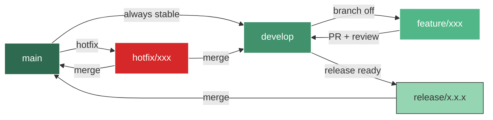

# 🔧 Contributing to ft_transcendence

Welcome to the team! This document explains how we work together — project architecture, branching strategy, commit conventions, PR process, and code standards.

**Read this before writing any code.**

---

## 📋 Table of Contents

- [Getting Started](#getting-started)
- [Project Architecture](#project-architecture)
- [Directory Structure](#directory-structure)
- [Frontend (React + Vite)](#frontend-react--vite)
- [Backend (NestJS)](#backend-nestjs)
- [SCSS Architecture & Graphical Chart](#scss-architecture--graphical-chart)
- [Testing](#testing)
- [Git Flow](#git-flow)
- [Branch Naming](#branch-naming)
- [Commit Convention](#commit-convention)
- [Pull Request Process](#pull-request-process)
- [Code Standards](#code-standards)
- [Code Review Guidelines](#code-review-guidelines)
- [Issue Workflow](#issue-workflow)
- [Vendor Directory](#vendor-directory)
- [AI Transparency](#ai-transparency)

---

## Getting Started

```bash
# 1. Clone the repo
git clone git@github.com:Univers42/ft_transcendence.git
cd ft_transcendence

# 2. Set up your environment
cp .env.example .env
make

# 3. Start development servers
make dev

# 4. Create your feature branch FROM develop
git checkout develop
git pull origin develop
git checkout -b feature/your-feature-name
```

### Essential Commands

| Command | Description |
|---------|-------------|
| `make` | First-time setup (containers + deps + migrations) |
| `make dev` | Start dev servers (frontend + backend) |
| `make test` | Run all tests |
| `make lint` | Run ESLint on all code |
| `make typecheck` | TypeScript type checking |
| `make gen-css` | Compile SASS → CSS |
| `make gen-css WATCH=1` | SASS watch mode |
| `make shell` | Open shell in dev container |
| `make help` | Show all available commands |

---

## Project Architecture

```
ft_transcendence/
├── apps/                    # Application code
│   ├── backend/             # NestJS API server
│   └── frontend/            # React + Vite SPA
├── packages/                # Shared code
│   └── shared/              # Types, utils shared between apps
├── docker/                  # Docker configuration
├── docs/                    # Documentation
├── scripts/                 # Utility scripts
└── vendor/                  # Third-party tools & 42-specific utilities
```

### What Goes Where?

| I want to... | Location |
|--------------|----------|
| Add a new API endpoint | `apps/backend/src/` |
| Create a React component | `apps/frontend/src/components/` |
| Add shared TypeScript types | `packages/shared/src/types/` |
| Write CSS/SCSS styles | `apps/frontend/src/styles/` |
| Add database models | `apps/backend/prisma/schema.prisma` |
| Add a utility script | `scripts/` |
| Configure Docker | `docker/` |

---

## Directory Structure

### `apps/backend/` — NestJS Backend

```
apps/backend/
├── prisma/
│   ├── schema.prisma        # Database schema (models)
│   └── migrations/          # Database migrations
├── src/
│   ├── main.ts              # Application entry point
│   ├── app.module.ts        # Root module
│   ├── auth/                # Auth module (JWT, OAuth, 2FA)
│   ├── users/               # Users module
│   ├── chat/                # Chat module (WebSockets)
│   ├── game/                # Game module (Pong)
│   └── common/              # Shared (guards, pipes, decorators)
├── test/
│   ├── jest-e2e.json        # E2E test config
│   └── *.e2e-spec.ts        # E2E tests
├── prisma.config.ts         # Prisma configuration
├── nest-cli.json            # NestJS CLI config
└── package.json
```

### `apps/frontend/` — React Frontend

```
apps/frontend/
├── public/                  # Static assets
├── src/
│   ├── main.tsx             # Entry point
│   ├── App.tsx              # Root component
│   ├── components/          # Reusable UI components
│   ├── pages/               # Page-level components
│   ├── hooks/               # Custom React hooks
│   ├── stores/              # Zustand state stores
│   ├── services/            # API client services
│   ├── styles/              # SCSS architecture (see below)
│   └── utils/               # Utility functions
├── index.html               # HTML template
├── vite.config.ts           # Vite configuration
└── package.json
```

---

## Frontend (React + Vite)

### Vite Configuration

Vite is our build tool. Key configuration in `vite.config.ts`:

```typescript
// Path aliases — use @/ instead of relative paths
alias: {
  '@': path.resolve(__dirname, 'src'),
  '@shared': path.resolve(__dirname, '../../packages/shared/src'),
}

// SCSS preprocessing — graphical chart auto-imported
css: {
  preprocessorOptions: {
    scss: {
      additionalData: `@use "@/styles/abstracts" as *;\n`,
    },
  },
}
```

### File Conventions

| Type | Convention | Example |
|------|-----------|---------|
| Components | PascalCase | `UserProfile.tsx` |
| Hooks | `use` prefix | `useAuth.ts` |
| Stores | camelCase + `Store` | `authStore.ts` |
| Services | camelCase + `Service` | `apiService.ts` |
| Types | PascalCase | `User.ts` |

### Adding a New Component

```tsx
// src/components/MyComponent.tsx
import styles from './MyComponent.module.scss';

interface MyComponentProps {
  title: string;
}

export function MyComponent({ title }: MyComponentProps) {
  return <div className={styles.container}>{title}</div>;
}
```

---

## Backend (NestJS)

### Module Structure

Each feature is a **module** with its own folder:

```
src/users/
├── users.module.ts          # Module definition
├── users.controller.ts      # HTTP endpoints
├── users.service.ts         # Business logic
├── users.gateway.ts         # WebSocket gateway (if needed)
├── dto/                     # Data Transfer Objects
│   ├── create-user.dto.ts
│   └── update-user.dto.ts
├── entities/                # TypeScript interfaces
│   └── user.entity.ts
└── users.spec.ts            # Unit tests
```

### Creating a New Module

```bash
# Inside the container
docker exec -it transcendence-dev bash
cd apps/backend
nest g module myfeature
nest g controller myfeature
nest g service myfeature
```

### Key NestJS Concepts

| Concept | Purpose | Location |
|---------|---------|----------|
| **Controllers** | Handle HTTP requests | `*.controller.ts` |
| **Services** | Business logic | `*.service.ts` |
| **Guards** | Authorization | `common/guards/` |
| **Pipes** | Validation/Transform | `common/pipes/` |
| **DTOs** | Request validation | `*/dto/` |
| **Gateways** | WebSocket handlers | `*.gateway.ts` |

---

## SCSS Architecture & Graphical Chart

We use **SASS/SCSS** for styling with a strict architecture. The **Graphical Chart** (`_graphical-chart.scss`) is the **single source of truth** for all design tokens.

### SCSS Directory Structure

```
src/styles/
├── base/
│   ├── _graphical-chart.scss   # 🎨 DESIGN SYSTEM — ALL TOKENS HERE
│   └── _reset.scss             # CSS reset + base styles
├── abstracts/
│   ├── _index.scss             # Re-exports graphical-chart + mixins
│   └── _mixins.scss            # Reusable SCSS mixins
├── layout/
│   ├── _app.scss               # App container layout
│   └── _footer.scss            # Footer styles
├── components/
│   ├── _hero.scss              # Hero section
│   ├── _cards.scss             # Card components
│   └── _quickstart.scss        # Quickstart section
├── utilities/
│   └── _animations.scss        # Keyframe animations
└── main.scss                   # Entry point (imports all)
```

### The Graphical Chart

**ALL design values MUST come from `_graphical-chart.scss`**. Never hardcode colors, sizes, or breakpoints.

```scss
// ❌ WRONG — Hardcoded values
.button {
  background: #7c3aed;
  padding: 12px 24px;
  border-radius: 8px;
}

// ✅ CORRECT — Using graphical chart variables
.button {
  background: $accent;
  padding: $spacing-3 $spacing-6;
  border-radius: $radius-md;
}
```

### Available Design Tokens

#### Colors
```scss
// Backgrounds
$bg-primary, $bg-secondary, $bg-card, $bg-card-hover

// Text
$text-primary, $text-secondary, $text-muted

// Accent (brand)
$accent, $accent-hover, $accent-light, $accent-glow

// Semantic
$color-success, $color-warning, $color-error, $color-info

// Borders
$border-color, $border-accent
```

#### Typography
```scss
// Font families
$font-family-sans, $font-family-mono

// Sizes (modular scale)
$font-size-xs, $font-size-sm, $font-size-base, $font-size-md,
$font-size-lg, $font-size-xl, $font-size-2xl, $font-size-3xl...

// Weights
$font-weight-normal, $font-weight-medium, $font-weight-semibold, $font-weight-bold
```

#### Spacing (8px grid)
```scss
$spacing-1 (4px), $spacing-2 (8px), $spacing-3 (12px), $spacing-4 (16px),
$spacing-6 (24px), $spacing-8 (32px), $spacing-12 (48px), $spacing-16 (64px)...
```

#### Breakpoints
```scss
$breakpoint-xs: 480px;   // Small phones
$breakpoint-sm: 640px;   // Large phones
$breakpoint-md: 768px;   // Tablets
$breakpoint-lg: 1024px;  // Laptops
$breakpoint-xl: 1280px;  // Desktops
```

### Using Mixins

```scss
@use '../abstracts' as *;

.my-component {
  // Responsive breakpoints
  @include sm {
    // Styles for screens < 640px
  }
  
  // Card pattern
  @include card;
  
  // Flex helpers
  @include flex-center;
  @include flex-between;
  
  // Focus accessibility
  &:focus {
    @include focus-ring;
  }
}
```

### Adding New Styles

1. **Create a new SCSS partial** in the appropriate folder:
   ```bash
   touch apps/frontend/src/styles/components/_my-component.scss
   ```

2. **Import the abstracts** and use graphical chart variables:
   ```scss
   // _my-component.scss
   @use '../abstracts' as *;
   
   .my-component {
     background: $bg-card;
     padding: $spacing-4;
     border-radius: $radius-lg;
   }
   ```

3. **Import in main.scss**:
   ```scss
   @use 'components/my-component';
   ```

4. **Compile** (if not in dev mode):
   ```bash
   make gen-css
   ```

### Extending the Graphical Chart

When adding new design tokens:

1. Add to `_graphical-chart.scss` in the appropriate section
2. Export as CSS variable if needed for JS theming (in the `@mixin export-css-variables`)
3. Document the new token in this guide

---

## Testing

### Test Architecture

```
apps/backend/
├── src/
│   └── *.spec.ts            # Unit tests (co-located)
└── test/
    ├── jest-e2e.json        # E2E config
    └── *.e2e-spec.ts        # E2E tests
```

### Running Tests

```bash
# All tests
make test

# Unit tests only
docker exec transcendence-dev sh -c "cd apps/backend && pnpm test"

# E2E tests only
docker exec transcendence-dev sh -c "cd apps/backend && pnpm run test:e2e"

# Watch mode (TDD)
docker exec -it transcendence-dev sh -c "cd apps/backend && pnpm run test:watch"

# With coverage
docker exec transcendence-dev sh -c "cd apps/backend && pnpm run test:cov"
```

### Writing Unit Tests

Create `*.spec.ts` files next to the code they test:

```typescript
// src/users/users.service.spec.ts
import { Test, TestingModule } from '@nestjs/testing';
import { UsersService } from './users.service';

describe('UsersService', () => {
  let service: UsersService;

  beforeEach(async () => {
    const module: TestingModule = await Test.createTestingModule({
      providers: [UsersService],
    }).compile();

    service = module.get<UsersService>(UsersService);
  });

  it('should be defined', () => {
    expect(service).toBeDefined();
  });

  describe('findOne', () => {
    it('should return a user by ID', async () => {
      const result = await service.findOne('123');
      expect(result).toHaveProperty('id', '123');
    });
  });
});
```

### Writing E2E Tests

E2E tests go in `test/*.e2e-spec.ts`:

```typescript
// test/users.e2e-spec.ts
import { Test, TestingModule } from '@nestjs/testing';
import { INestApplication } from '@nestjs/common';
import * as request from 'supertest';
import { AppModule } from '../src/app.module';

describe('UsersController (e2e)', () => {
  let app: INestApplication;

  beforeEach(async () => {
    const moduleFixture: TestingModule = await Test.createTestingModule({
      imports: [AppModule],
    }).compile();

    app = moduleFixture.createNestApplication();
    await app.init();
  });

  afterEach(async () => {
    await app.close();
  });

  it('/users (GET)', () => {
    return request(app.getHttpServer())
      .get('/users')
      .expect(200)
      .expect((res) => {
        expect(Array.isArray(res.body)).toBe(true);
      });
  });
});
```

### Jest Configuration

**Unit tests** (`package.json`):
```json
{
  "jest": {
    "rootDir": "src",
    "testRegex": ".*\\.spec\\.ts$",
    "transform": { "^.+\\.(t|j)s$": "ts-jest" },
    "testEnvironment": "node"
  }
}
```

**E2E tests** (`test/jest-e2e.json`):
```json
{
  "rootDir": ".",
  "testRegex": ".e2e-spec.ts$",
  "transform": { "^.+\\.(t|j)s$": "ts-jest" },
  "testEnvironment": "node"
}
```

---

## Git Flow

We use **Git Flow** — a structured branching model that keeps `main` stable and `develop` as the integration branch.



### Branch Rules

| Branch | Purpose | Merge Target | Protected |
|--------|---------|-------------|-----------|
| `main` | Production-ready code | — | ✅ No direct push |
| `develop` | Integration branch | `main` (via release) | ✅ No direct push |
| `feature/*` | New features | `develop` (via PR) | ❌ |
| `fix/*` | Bug fixes | `develop` (via PR) | ❌ |
| `hotfix/*` | Critical production fixes | `main` + `develop` | ❌ |
| `release/*` | Release preparation | `main` + `develop` | ❌ |

### Golden Rules

1. **Never push directly to `main` or `develop`** — always go through a PR
2. **Always branch from `develop`** for features and fixes
3. **Keep branches short-lived** — merge within 2-3 days max
4. **Delete branches after merge** — keep the repo clean

---

## Branch Naming

```
<type>/<short-description>
```

| Type | When | Example |
|------|------|---------|
| `feature/` | New functionality | `feature/auth-oauth` |
| `fix/` | Bug fix | `fix/42-login-redirect` |
| `hotfix/` | Urgent production fix | `hotfix/cors-origin` |
| `release/` | Release prep | `release/1.0.0` |
| `docs/` | Documentation only | `docs/api-endpoints` |
| `refactor/` | Code improvement | `refactor/extract-guards` |
| `test/` | Adding tests | `test/auth-e2e` |

---

## Commit Convention

We follow [Conventional Commits](https://www.conventionalcommits.org/):

```
<type>(<scope>): <short description>

[optional body]

[optional footer]
```

### Types

| Type | Description |
|------|-------------|
| `feat` | New feature |
| `fix` | Bug fix |
| `docs` | Documentation only |
| `style` | Formatting, no logic change |
| `refactor` | Code change that neither fixes a bug nor adds a feature |
| `test` | Adding or updating tests |
| `chore` | Tooling, deps, CI, config |
| `perf` | Performance improvement |

### Examples

```bash
feat(auth): implement JWT refresh token rotation
fix(game): correct ball physics at high velocities
docs(readme): add environment variables section
refactor(users): extract profile validation to shared pipe
test(chat): add WebSocket connection E2E tests
chore(docker): upgrade PostgreSQL to 16.2
```

### Scope

Use the module name: `auth`, `users`, `game`, `chat`, `docker`, `ci`, `prisma`, etc.

---

## Pull Request Process

### Before Opening a PR

- [ ] Your branch is up to date with `develop` (`git rebase develop`)
- [ ] All tests pass locally (`make test`)
- [ ] Linter passes (`make lint`)
- [ ] TypeScript compiles with no errors (`make typecheck`)
- [ ] You've tested your feature manually

### PR Requirements

1. **Use the PR template** — it's auto-loaded when you open a PR
2. **Title follows commit convention** — e.g., `feat(auth): add Google OAuth login`
3. **Description explains what and why** — not just "fixed stuff"
4. **Link related issues** — `Closes #12` or `Related to #15`
5. **Screenshots/videos for UI changes** — before/after if applicable
6. **AI disclosure** — note if AI was used and for what

### Review Process

1. Open PR → Assign at least 1 reviewer (ideally 2)
2. CI runs automatically (lint + test + typecheck)
3. Reviewer approves or requests changes
4. Address all feedback
5. **Squash merge** into `develop`
6. Delete the source branch

### Review SLA

- Aim to review PRs within **24 hours**
- If you're blocked on a review, ping in Discord

---

## Code Standards

### TypeScript

- **Strict mode** — `strict: true` in all `tsconfig.json` files
- **No `any`** — use `unknown` and narrow with type guards
- **Explicit return types** on all functions
- **Interface over type** for object shapes (unless union/intersection needed)
- **Readonly where possible** — immutability by default

### Backend (NestJS)

- One module per feature domain (e.g., `auth.module.ts`, `users.module.ts`)
- DTOs for all request/response validation (with `class-validator`)
- Guards for authorization, Pipes for validation, Interceptors for transformation
- Services contain business logic, Controllers are thin
- All endpoints documented with `@ApiTags`, `@ApiOperation`, `@ApiResponse`

### Frontend (React)

- Functional components only (no class components)
- Custom hooks for reusable logic (`use*.ts`)
- Co-located tests (`Component.test.tsx` next to `Component.tsx`)
- Props interfaces named `ComponentNameProps`
- Lazy loading for route-level code splitting

### File Naming

| What | Convention | Example |
|------|-----------|---------|
| Components | PascalCase | `UserProfile.tsx` |
| Hooks | camelCase with `use` prefix | `useAuth.ts` |
| Services | camelCase | `auth.service.ts` |
| Modules | camelCase | `auth.module.ts` |
| Tests | Same name + `.spec.ts` / `.test.tsx` | `auth.service.spec.ts` |
| Types/Interfaces | PascalCase | `User.ts`, `AuthPayload.ts` |

---

## Code Review Guidelines

### For Reviewers

- **Be kind, be specific** — "This could cause a race condition because…" not "This is wrong"
- **Suggest, don't demand** — "Consider using X here because…"
- **Approve if it's good enough** — perfect is the enemy of shipped
- **Test the branch locally** if the change is significant
- **Check for**: security issues, missing tests, broken types, naming, edge cases

### For Authors

- **Don't take it personally** — feedback is about the code, not you
- **Respond to every comment** — even if just "Done ✅"
- **Ask for clarification** if you don't understand the feedback
- **Don't force-push after review** — push new commits so reviewers can see the diff

---

## Issue Workflow

### Creating Issues

Use the issue templates (Bug Report or Feature Request). Every issue should have:

- **Clear title** — what's broken or what's needed
- **Labels** — `bug`, `feature`, `docs`, `refactor`, etc.
- **Assignee** — who's working on it
- **Milestone** — which sprint/release it targets

### Issue Lifecycle

```
Open → In Progress → In Review → Done
```

Link issues to PRs: when a PR description says `Closes #42`, the issue auto-closes on merge.

---

## Vendor Directory

The `vendor/` directory contains **third-party tools** and **42-specific utilities**. These are scripts that support development but are not part of the main application.

### Structure

```
vendor/
├── scripts/                 # General utility scripts
│   ├── checker.py           # Code validation tools
│   ├── leaks_check.py       # Memory leak checking
│   ├── clean_cache.sh       # Cache cleanup utilities
│   ├── install-hooks.sh     # Git hooks installer
│   └── hooks/               # Pre-commit, post-checkout hooks
└── set-debian/              # 42 School VM setup tools
    ├── Makefile             # VM automation
    ├── rebuild_iso_create_vm.sh
    ├── setup/               # Initial VM setup scripts
    ├── preseeds/            # Automated install configs
    ├── utils/               # Helper utilities
    └── diagnostic/          # Debug tools
```

### `vendor/scripts/` — Development Utilities

| Script | Purpose |
|--------|---------|
| `checker.py` | Run project validators |
| `leaks_check.py` | Check for memory leaks (C projects) |
| `clean_cache.sh` | Clean build caches |
| `install-hooks.sh` | Install Git hooks to `vendor/scripts/hooks/` |
| `terminal_colors.py` | Terminal color utilities |
| `valgrind_check.sh` | Run Valgrind (C projects) |

**Installing Git hooks:**
```bash
./vendor/scripts/install-hooks.sh
```

### `vendor/set-debian/` — 42 School Environment

This directory contains tools for setting up **42 School VMs** with Debian. It automates the creation and configuration of development VMs matching the 42 cluster environment.

> ⚠️ **42 Students Only**: These tools are specific to 42's infrastructure. Non-42 contributors can ignore this directory.

**Key functionality:**
- Preseed configurations for automated Debian installation
- SSH setup between host and VM
- VM backup and restore utilities
- Environment synchronization with 42 clusters

**Quick setup:**
```bash
cd vendor/set-debian
make        # Follow the interactive setup
```

### When to Use Vendor Scripts

| I want to... | Script |
|--------------|--------|
| Install Git hooks | `vendor/scripts/install-hooks.sh` |
| Clean all caches | `vendor/scripts/clean_cache.sh` |
| Set up 42 VM | `vendor/set-debian/` (42 students) |
| Check code standards | `vendor/scripts/checker.py` |

### Contributing to Vendor

- **Don't modify vendor scripts** unless fixing a bug
- **Document any changes** in the script's header comment
- **New tools** should go in `scripts/` (not `vendor/`) unless they're truly third-party

---

## AI Transparency

Per 42's policy and our team agreement:

- **Disclose AI usage** in every PR description
- **Format**: "AI assisted with: [specific task]" or "No AI used"
- **Rule**: If you can't explain the code during evaluation, it shouldn't be in the repo
- **Peer review** is the quality checkpoint — AI doesn't replace human review

---

## Quick Reference

### Essential Commands Cheat Sheet

```bash
# Development
make dev                 # Start dev servers
make shell               # Open container shell
make logs                # View container logs

# Quality
make lint                # Run ESLint
make typecheck           # TypeScript check
make test                # Run all tests

# Styling
make gen-css             # Compile SASS once
make gen-css WATCH=1     # SASS watch mode

# Database
make db-studio           # Open Prisma Studio
make db-migrate          # Run migrations
make db-reset            # Reset database

# Cleanup
make clean               # Stop containers
make fclean              # Full cleanup
make kill-ports          # Kill conflicting ports
```

### File Locations Cheat Sheet

| What | Location |
|------|----------|
| API endpoints | `apps/backend/src/*/` |
| React components | `apps/frontend/src/components/` |
| SCSS styles | `apps/frontend/src/styles/` |
| Graphical chart (design tokens) | `apps/frontend/src/styles/base/_graphical-chart.scss` |
| Database schema | `apps/backend/prisma/schema.prisma` |
| Shared types | `packages/shared/src/types/` |
| Docker config | `docker/` |
| CI/CD | `.github/workflows/` |

### Git Workflow Cheat Sheet

```bash
# Start new feature
git checkout develop && git pull
git checkout -b feature/my-feature

# Keep in sync
git fetch origin
git rebase origin/develop

# Commit
git add .
git commit -m "feat(scope): description"

# Push and create PR
git push -u origin feature/my-feature
# → Open PR to develop on GitHub
```

---

*Questions about the workflow? Bring them up in the next standup or ping in Discord.*
