# Contributing to ft_transcendence

Everything you need to know before writing code on this project. Architecture, conventions, how to test, how to style, how to commit. If something isn't covered here, ask on Discord.

---

## Table of Contents

- [Getting Started](#getting-started)
- [Project Architecture](#project-architecture)
- [Directory Structure](#directory-structure)
- [Frontend — React + Vite](#frontend--react--vite)
- [Backend — NestJS](#backend--nestjs)
- [SCSS & the Graphical Chart](#scss--the-graphical-chart)
- [Testing](#testing)
- [Git Flow](#git-flow)
- [Branch Naming](#branch-naming)
- [Commits](#commits)
- [Pull Requests](#pull-requests)
- [Code Standards](#code-standards)
- [Code Review](#code-review)
- [Issues](#issues)
- [Vendor Directory](#vendor-directory)
- [AI Transparency](#ai-transparency)
- [Cheat Sheet](#cheat-sheet)
- [References](#references)

---

## Getting Started

```bash
git clone git@github.com:Univers42/ft_transcendence.git
cd ft_transcendence
cp .env.example .env
make          # first-time setup
make dev      # start everything
```

Then create your branch from `develop`:

```bash
git checkout develop && git pull
git checkout -b feature/my-thing
```

### Commands you'll use daily

| Command | What it does |
|---------|-------------|
| `make dev` | Start frontend + backend |
| `make test` | Run all tests |
| `make lint` | ESLint |
| `make typecheck` | TypeScript checks |
| `make gen-css` | Compile SASS once |
| `make gen-css WATCH=1` | SASS in watch mode |
| `make shell` | Shell into the container |
| `make help` | List everything |

---

## Project Architecture

Here's the big picture — how the pieces connect:

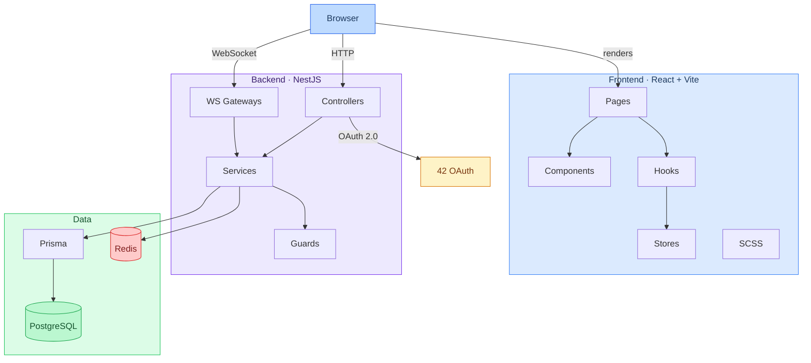

### File tree

```
ft_transcendence/
├── apps/
│   ├── backend/             # NestJS API
│   └── frontend/            # React SPA
├── packages/
│   └── shared/              # Shared types & utils
├── docker/                  # Dockerfiles, nginx
├── docs/                    # Extra docs
├── scripts/                 # Helper scripts
└── vendor/                  # Third-party & 42 tools
```

### Where does my code go?

| I need to… | Put it in |
|------------|-----------|
| New API route | `apps/backend/src/<module>/` |
| React component | `apps/frontend/src/components/` |
| Shared types | `packages/shared/src/types/` |
| Styles | `apps/frontend/src/styles/` |
| DB model | `apps/backend/prisma/schema.prisma` |
| Docker config | `docker/` |

---

## Directory Structure

### Backend

```
apps/backend/
├── prisma/
│   ├── schema.prisma        # DB models
│   └── migrations/
├── src/
│   ├── main.ts              # Entry point
│   ├── app.module.ts        # Root module
│   ├── auth/                # Auth (JWT, OAuth, 2FA)
│   ├── users/               # Users
│   ├── chat/                # Chat (WebSockets)
│   ├── game/                # Pong game
│   └── common/              # Guards, pipes, decorators
├── test/
│   └── *.e2e-spec.ts        # E2E tests
├── prisma.config.ts
└── package.json
```

### Frontend

```
apps/frontend/
├── src/
│   ├── main.tsx             # Entry point
│   ├── App.tsx              # Root component
│   ├── components/          # UI components
│   ├── pages/               # Route-level pages
│   ├── hooks/               # Custom hooks
│   ├── stores/              # Zustand stores
│   ├── services/            # API calls
│   ├── styles/              # SCSS (see below)
│   └── utils/
├── index.html
├── vite.config.ts
└── package.json
```

---

## Frontend — React + Vite

How the React app is organized:

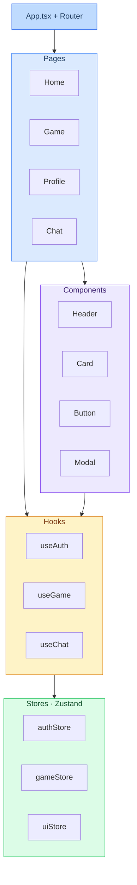

### How Vite builds things

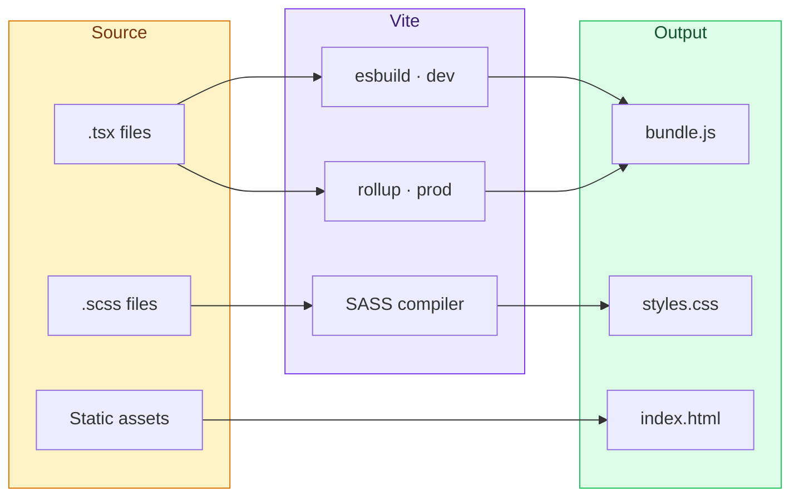

### Vite config highlights

```typescript
// Path aliases — use @/ instead of ../../
alias: {
  '@': path.resolve(__dirname, 'src'),
  '@shared': path.resolve(__dirname, '../../packages/shared/src'),
}

// SCSS — graphical chart is auto-imported everywhere
css: {
  preprocessorOptions: {
    scss: {
      additionalData: `@use "@/styles/abstracts" as *;\n`,
    },
  },
}
```

### Naming

| What | Convention | Example |
|------|-----------|---------|
| Components | PascalCase | `UserProfile.tsx` |
| Hooks | `use` prefix | `useAuth.ts` |
| Stores | camelCase + Store | `authStore.ts` |
| Types | PascalCase | `User.ts` |

### New component template

```tsx
import styles from './MyComponent.module.scss';

interface MyComponentProps {
  title: string;
}

export function MyComponent({ title }: MyComponentProps) {
  return <div className={styles.container}>{title}</div>;
}
```

---

## Backend — NestJS

Every request goes through this pipeline. If something blocks, check where it fails in this chain:

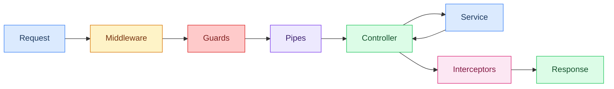

**Middleware** = logging, CORS, Helmet · **Guards** = auth checks · **Pipes** = validation · **Interceptors** = response shaping

### One module = one feature

```
src/users/
├── users.module.ts          # wires it all
├── users.controller.ts      # HTTP routes
├── users.service.ts         # logic
├── users.gateway.ts         # WS (if needed)
├── dto/
│   ├── create-user.dto.ts
│   └── update-user.dto.ts
├── entities/
│   └── user.entity.ts
└── users.spec.ts            # tests
```

### Scaffold a new module

```bash
docker exec -it transcendence-dev bash
cd apps/backend
nest g module myfeature
nest g controller myfeature
nest g service myfeature
```

### Quick reference

| Concept | Role | Files |
|---------|------|-------|
| Controllers | HTTP handlers | `*.controller.ts` |
| Services | Business logic | `*.service.ts` |
| Guards | Auth/authorization | `common/guards/` |
| Pipes | Validation | `common/pipes/` |
| DTOs | Request schemas | `*/dto/` |
| Gateways | WebSocket | `*.gateway.ts` |

---

## SCSS & the Graphical Chart

All styling goes through SASS. The **graphical chart** (`_graphical-chart.scss`) is the single source of truth for every color, size, font, and breakpoint. Nothing gets hardcoded.

### How it flows

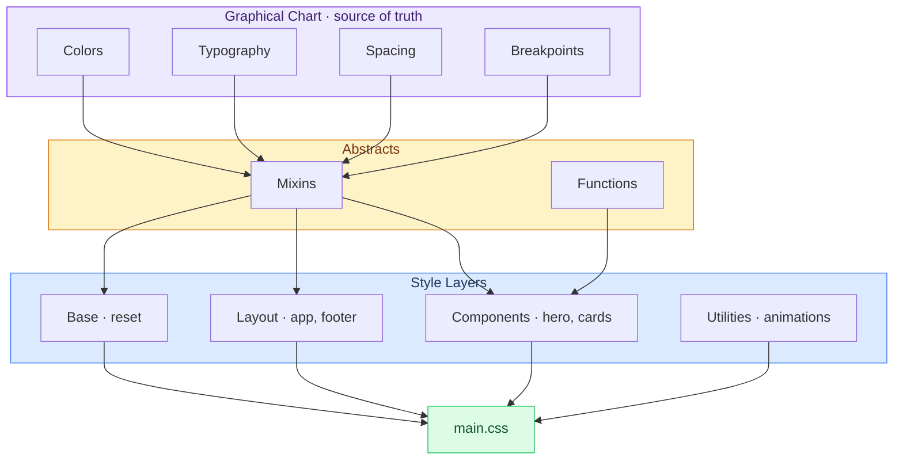

### Breakpoints — mobile first

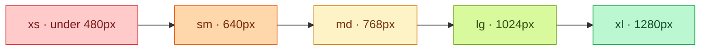

Use `@include sm-up`, `@include md-up`, etc. to go upward. Use `@include sm`, `@include md` to go downward.

### File structure

```
src/styles/
├── base/
│   ├── _graphical-chart.scss   # ALL tokens live here
│   └── _reset.scss
├── abstracts/
│   ├── _index.scss             # Re-exports chart + mixins
│   └── _mixins.scss
├── layout/
│   ├── _app.scss
│   └── _footer.scss
├── components/
│   ├── _hero.scss
│   ├── _cards.scss
│   └── _quickstart.scss
├── utilities/
│   └── _animations.scss
└── main.scss                   # Imports everything
```

### The golden rule

Never hardcode values. Always use variables from the graphical chart.

```scss
// Don't
.button {
  background: #7c3aed;
  padding: 12px 24px;
  border-radius: 8px;
}

// Do
.button {
  background: $accent;
  padding: $spacing-3 $spacing-6;
  border-radius: $radius-md;
}
```

### Available tokens

**Colors** — `$bg-primary`, `$bg-card`, `$text-primary`, `$text-muted`, `$accent`, `$accent-hover`, `$color-success`, `$color-error`, `$border-color`

**Typography** — `$font-family-sans`, `$font-family-mono`, `$font-size-xs` through `$font-size-5xl`, `$font-weight-normal` through `$font-weight-bold`

**Spacing** (8px grid) — `$spacing-1` (4px) through `$spacing-32` (256px)

**Breakpoints** — `$breakpoint-xs` (480px), `$breakpoint-sm` (640px), `$breakpoint-md` (768px), `$breakpoint-lg` (1024px), `$breakpoint-xl` (1280px)

### Mixins

```scss
@use '../abstracts' as *;

.thing {
  @include card;           // card pattern
  @include flex-center;    // center children
  @include focus-ring;     // a11y focus

  @include sm { /* < 640px */ }
  @include md-up { /* >= 768px */ }
}
```

### Adding styles

1. Create `apps/frontend/src/styles/components/_my-thing.scss`
2. Import abstracts and use chart variables
3. Add `@use 'components/my-thing';` in `main.scss`
4. Run `make gen-css` (or it auto-compiles in dev mode)

---

## Testing

We want most of our tests at the unit level, fewer at integration, fewest at E2E.

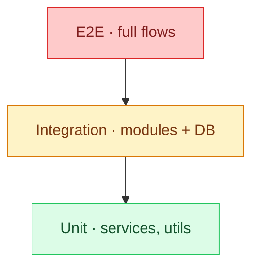

Aim for roughly: **70% unit · 20% integration · 10% E2E**.

### How to run

```bash
make test                     # everything

# Or inside the container:
pnpm test                     # unit
pnpm run test:e2e             # e2e
pnpm run test:watch           # TDD mode
pnpm run test:cov             # coverage report
```

### The dev loop

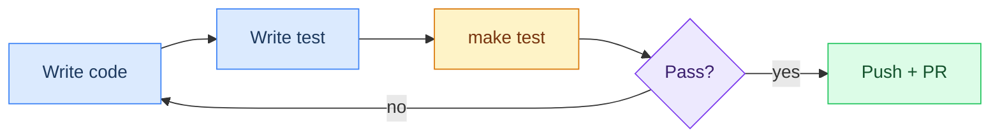

### Where tests live

```
apps/backend/
├── src/
│   └── *.spec.ts            # Unit tests (next to the code)
└── test/
    └── *.e2e-spec.ts        # E2E tests
```

### Unit test example

```typescript
import { Test, TestingModule } from '@nestjs/testing';
import { UsersService } from './users.service';

describe('UsersService', () => {
  let service: UsersService;

  beforeEach(async () => {
    const module: TestingModule = await Test.createTestingModule({
      providers: [UsersService],
    }).compile();
    service = module.get<UsersService>(UsersService);
  });

  it('should be defined', () => {
    expect(service).toBeDefined();
  });
});
```

### E2E test example

```typescript
import * as request from 'supertest';
import { AppModule } from '../src/app.module';
import { Test } from '@nestjs/testing';
import { INestApplication } from '@nestjs/common';

describe('Users (e2e)', () => {
  let app: INestApplication;

  beforeEach(async () => {
    const module = await Test.createTestingModule({
      imports: [AppModule],
    }).compile();
    app = module.createNestApplication();
    await app.init();
  });

  afterEach(() => app.close());

  it('GET /users', () =>
    request(app.getHttpServer())
      .get('/users')
      .expect(200));
});
```

---

## Git Flow

`main` is always production-ready. `develop` is where features land. Never push directly to either.

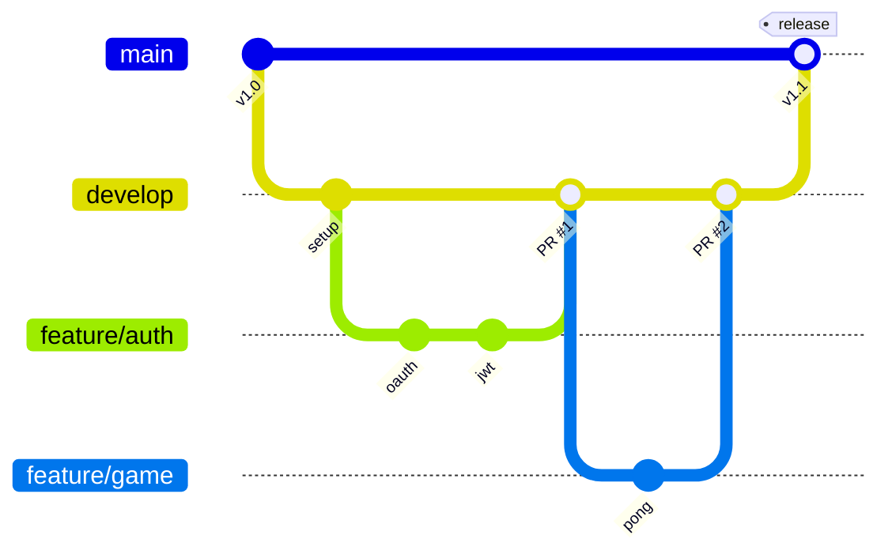

### Branch rules

| Branch | For | Merges into | Protected? |
|--------|-----|------------|------------|
| `main` | Production | — | Yes |
| `develop` | Integration | `main` via release | Yes |
| `feature/*` | New stuff | `develop` via PR | No |
| `fix/*` | Bug fixes | `develop` via PR | No |
| `hotfix/*` | Urgent prod fixes | `main` + `develop` | No |
| `release/*` | Release prep | `main` + `develop` | No |

### Rules

1. Never push to `main` or `develop` directly
2. Always branch from `develop`
3. Keep branches short — merge in 2–3 days
4. Delete branches after merge

---

## Branch Naming

```
<type>/<description>
```

| Type | Use for | Example |
|------|---------|---------|
| `feature/` | New feature | `feature/auth-oauth` |
| `fix/` | Bug fix | `fix/login-redirect` |
| `hotfix/` | Urgent prod fix | `hotfix/cors` |
| `release/` | Release | `release/1.0.0` |
| `docs/` | Docs only | `docs/api-endpoints` |
| `refactor/` | Cleanup | `refactor/extract-guards` |
| `test/` | Tests | `test/auth-e2e` |

---

## Commits

We use [Conventional Commits](https://www.conventionalcommits.org/):

```
type(scope): short description
```

| Type | Meaning |
|------|---------|
| `feat` | New feature |
| `fix` | Bug fix |
| `docs` | Docs only |
| `style` | Formatting, no logic |
| `refactor` | Neither fix nor feature |
| `test` | Tests |
| `chore` | Tooling, CI, deps |
| `perf` | Performance |

**Scope** = module name: `auth`, `users`, `game`, `chat`, `docker`, `ci`, `prisma`…

```bash
feat(auth): add JWT refresh rotation
fix(game): ball physics at high speed
docs(readme): add env variables section
test(chat): websocket e2e tests
chore(docker): upgrade postgres to 16.2
```

---

## Pull Requests

### The lifecycle

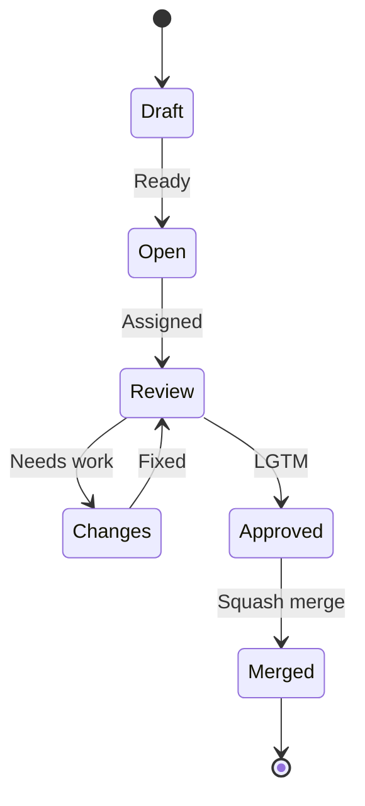

### What CI checks on every PR

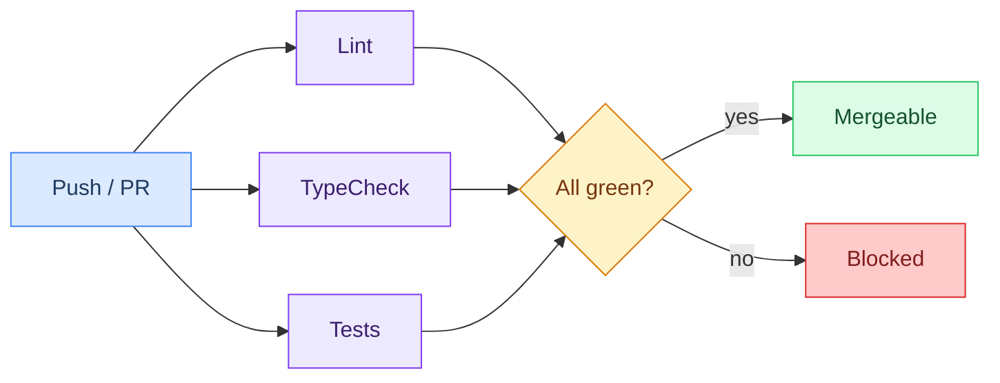

### Before you open one

- [ ] Rebased on `develop`
- [ ] `make test` passes
- [ ] `make lint` passes
- [ ] `make typecheck` passes
- [ ] Tested manually

### What goes in the PR

1. Title follows commit convention — `feat(auth): add google login`
2. Description says **what** and **why**
3. Link issues — `Closes #12`
4. Screenshots for UI changes
5. AI disclosure (see below)

### Review flow

1. Open PR, assign 1–2 reviewers
2. CI runs (lint + typecheck + tests)
3. Reviewer approves or requests changes
4. Address feedback
5. Squash merge into `develop`
6. Delete the branch

Try to review within **24 hours**. Ping on Discord if blocked.

---

## Code Standards

### TypeScript

- `strict: true` everywhere
- No `any` — use `unknown` and type guards
- Explicit return types
- `interface` over `type` for objects
- `readonly` by default

### Backend

- One module per feature
- DTOs for all validation (class-validator)
- Services hold logic, controllers are thin
- Document endpoints with Swagger decorators

### Frontend

- Functional components only
- Hooks for reusable logic
- Tests next to the component
- Lazy-load pages

### Naming

| What | Style | Example |
|------|-------|---------|
| Components | PascalCase | `UserProfile.tsx` |
| Hooks | usePrefix | `useAuth.ts` |
| Services | camelCase | `auth.service.ts` |
| Tests | same + `.spec` | `auth.service.spec.ts` |
| Types | PascalCase | `AuthPayload.ts` |

---

## Code Review

**Reviewers** — be kind, be specific. Say "this might cause X because…" not "this is wrong". Approve when it's good enough; perfect ships never.

**Authors** — don't take it personally. Respond to every comment. Don't force-push after review started — push new commits so the reviewer can track the diff.

---

## Issues

### How an issue moves

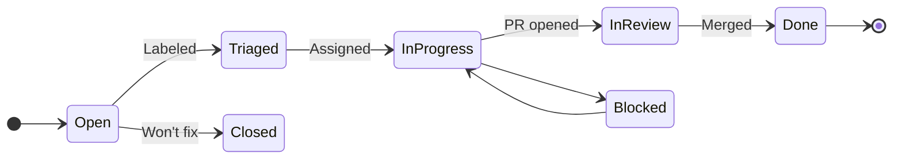

### Board

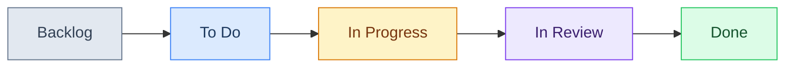

Every issue needs: clear title, labels, assignee, milestone. Use `Closes #42` in your PR to auto-close.

---

## Vendor Directory

`vendor/` holds third-party tools and 42-specific stuff. It's not part of the app itself.

```
vendor/
├── scripts/                 # Dev utilities
│   ├── checker.py           # Code validators
│   ├── clean_cache.sh       # Cache cleanup
│   ├── install-hooks.sh     # Git hooks setup
│   └── hooks/               # The actual hooks
└── set-debian/              # 42 VM setup (42 students only)
    ├── Makefile
    ├── setup/
    ├── preseeds/
    └── utils/
```

**Install git hooks:** `./vendor/scripts/install-hooks.sh`

The `set-debian/` directory automates Debian VM creation for 42 clusters. If you're not at 42, ignore it entirely.

Don't modify vendor scripts unless fixing a bug. New tools go in `scripts/` at the repo root.

---

## AI Transparency

Per 42's rules:

- Every PR states whether AI was used and for what
- Format: `AI assisted with: [task]` or `No AI used`
- If you can't explain the code at evaluation, don't submit it
- Review is the real quality gate — AI doesn't replace that

---

## Cheat Sheet

### Commands

```bash
make dev                 # dev servers
make shell               # container shell
make logs                # container logs
make lint                # eslint
make typecheck           # tsc
make test                # jest
make gen-css             # compile sass
make gen-css WATCH=1     # sass watch
make db-studio           # prisma studio
make db-migrate          # run migrations
make db-reset            # reset db
make clean               # stop containers
make fclean              # nuke everything
make kill-ports          # free stuck ports
```

### File locations

| What | Where |
|------|-------|
| API routes | `apps/backend/src/*/` |
| React components | `apps/frontend/src/components/` |
| SCSS styles | `apps/frontend/src/styles/` |
| Design tokens | `apps/frontend/src/styles/base/_graphical-chart.scss` |
| DB schema | `apps/backend/prisma/schema.prisma` |
| Shared types | `packages/shared/src/types/` |
| Docker | `docker/` |
| CI | `.github/workflows/` |

### Git

```bash
git checkout develop && git pull
git checkout -b feature/my-thing
# ... work ...
git add . && git commit -m "feat(scope): what I did"
git push -u origin feature/my-thing
# open PR to develop
```

---

## References

Stuff worth reading to get better at each area of this project.

### Architecture

| What | Link |
|------|------|
| The Twelve-Factor App | [12factor.net](https://12factor.net/) |
| Clean Architecture — R. C. Martin | [O'Reilly](https://www.oreilly.com/library/view/clean-architecture-a/9780134494272/) |
| Monorepo patterns | [monorepo.tools](https://monorepo.tools/) |
| Enterprise Patterns — Fowler | [martinfowler.com](https://martinfowler.com/books/eaa.html) |

### React & Frontend

| What | Link |
|------|------|
| React docs | [react.dev](https://react.dev/) |
| React + TypeScript cheatsheet | [GitHub](https://github.com/typescript-cheatsheets/react) |
| Bulletproof React (architecture) | [GitHub](https://github.com/alan2207/bulletproof-react) |
| Zustand docs | [pmnd.rs](https://docs.pmnd.rs/zustand/getting-started/introduction) |
| Vite guide | [vitejs.dev](https://vitejs.dev/guide/) |

### NestJS & Backend

| What | Link |
|------|------|
| NestJS docs | [docs.nestjs.com](https://docs.nestjs.com/) |
| NestJS fundamentals course | [courses.nestjs.com](https://courses.nestjs.com/) |
| Prisma docs | [prisma.io/docs](https://www.prisma.io/docs/) |
| JWT handbook — Auth0 | [Auth0](https://auth0.com/resources/ebooks/jwt-handbook) |
| Microsoft REST API guidelines | [GitHub](https://github.com/microsoft/api-guidelines) |
| WebSocket spec (RFC 6455) | [IETF](https://datatracker.ietf.org/doc/html/rfc6455) |

### CSS / SCSS

| What | Link |
|------|------|
| SASS docs | [sass-lang.com](https://sass-lang.com/documentation/) |
| CSS Guidelines — Harry Roberts | [cssguidelin.es](https://cssguidelin.es/) |
| ITCSS architecture | [xfive.co](https://www.xfive.co/blog/itcss-scalable-maintainable-css-architecture/) |
| W3C Design Tokens spec | [W3C](https://design-tokens.github.io/community-group/format/) |
| Every Layout | [every-layout.dev](https://every-layout.dev/) |
| Modern CSS | [moderncss.dev](https://moderncss.dev/) |

### Testing

| What | Link |
|------|------|
| Jest docs | [jestjs.io](https://jestjs.io/docs/getting-started) |
| Testing Library | [testing-library.com](https://testing-library.com/docs/) |
| NestJS testing guide | [NestJS docs](https://docs.nestjs.com/fundamentals/testing) |
| TDD — Kent Beck | [O'Reilly](https://www.oreilly.com/library/view/test-driven-development/0321146530/) |
| The Testing Trophy — Kent C. Dodds | [Blog](https://kentcdodds.com/blog/the-testing-trophy-and-testing-classifications) |

### Git

| What | Link |
|------|------|
| Conventional Commits | [conventionalcommits.org](https://www.conventionalcommits.org/) |
| Git Flow — Vincent Driessen | [nvie.com](https://nvie.com/posts/a-successful-git-branching-model/) |
| Semantic Versioning | [semver.org](https://semver.org/) |
| Pro Git book | [git-scm.com](https://git-scm.com/book/en/v2) |

### Docker & CI

| What | Link |
|------|------|
| Docker docs | [docs.docker.com](https://docs.docker.com/) |
| Docker Compose | [docs.docker.com/compose](https://docs.docker.com/compose/) |
| Dockerfile best practices | [Docker docs](https://docs.docker.com/develop/develop-images/dockerfile_best-practices/) |
| GitHub Actions | [docs.github.com/actions](https://docs.github.com/en/actions) |

### TypeScript

| What | Link |
|------|------|
| TypeScript Handbook | [typescriptlang.org](https://www.typescriptlang.org/docs/handbook/) |
| Type Challenges (practice) | [GitHub](https://github.com/type-challenges/type-challenges) |
| Total TypeScript | [totaltypescript.com](https://www.totaltypescript.com/) |

### Security

| What | Link |
|------|------|
| OWASP Top 10 | [owasp.org](https://owasp.org/www-project-top-ten/) |
| OWASP Cheat Sheets | [cheatsheetseries.owasp.org](https://cheatsheetseries.owasp.org/) |
| OAuth 2.0 explained | [oauth.net](https://oauth.net/2/) |

### Code Quality

| What | Link |
|------|------|
| Clean Code — R. C. Martin | [O'Reilly](https://www.oreilly.com/library/view/clean-code-a/9780136083238/) |
| Refactoring — Fowler | [refactoring.com](https://refactoring.com/) |
| The Pragmatic Programmer | [pragprog.com](https://pragprog.com/titles/tpp20/the-pragmatic-programmer-20th-anniversary-edition/) |
| Google Code Review guide | [Google](https://google.github.io/eng-practices/review/) |
| Airbnb JS style guide | [GitHub](https://github.com/airbnb/javascript) |

### 42

| What | Link |
|------|------|
| 42 Intra | [intra.42.fr](https://intra.42.fr/) |
| 42 API docs | [api.intra.42.fr](https://api.intra.42.fr/apidoc) |

### YouTube worth watching

| Channel | Focus | Link |
|---------|-------|------|
| Fireship | Quick tech explainers | [YouTube](https://www.youtube.com/@Fireship) |
| Theo (t3.gg) | React, TS, full-stack | [YouTube](https://www.youtube.com/@t3dotgg) |
| Jack Herrington | React architecture | [YouTube](https://www.youtube.com/@jherr) |
| Kevin Powell | CSS deep dives | [YouTube](https://www.youtube.com/@KevinPowell) |
| Web Dev Simplified | Fundamentals | [YouTube](https://www.youtube.com/@WebDevSimplified) |

---

*Got questions? Bring them to the next standup or drop them on Discord.*
