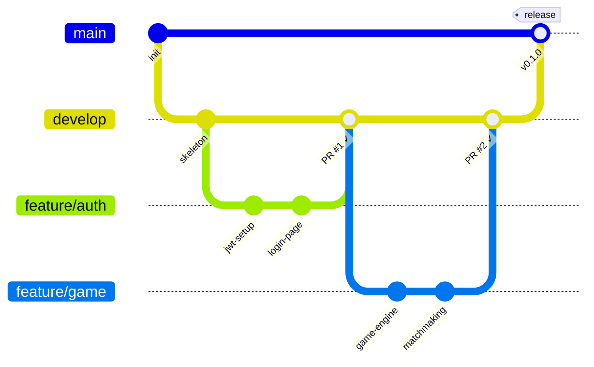
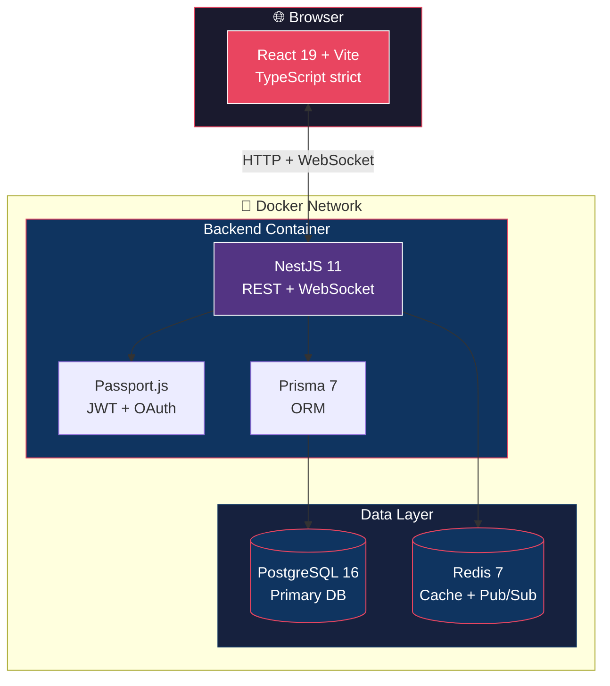

# 🏓 ft_transcendence

*Final Project — 42 Common Core — Team Univers42, 2026*

> A real-time multiplayer web application built as a team. Full-stack, containerized, production-ready.

[]()
[]()
[]()
[]()
[](LICENSE)

---

## 📋 Table of Contents

- [Overview](#-overview)
- [Team & Roles](#-team--roles)
- [Tech Stack](#-tech-stack)
- [Quick Start](#-quick-start)
- [Project Structure](#-project-structure)
- [Development Workflow](#-development-workflow)
- [Make Commands](#-make-commands)
- [Environment Variables](#-environment-variables)
- [Testing](#-testing)
- [Architecture](#-architecture)
- [Documentation](#-documentation)
- [AI Usage Policy](#-ai-usage-policy)
- [License](#-license)

---

## 🎯 Overview

**ft_transcendence** is the capstone group project of the 42 Common Core. It challenges a team of 4–5 students to design, build, and deploy a full-featured web application from scratch — combining real-time features, user management, security, and modern DevOps practices.

This repository is the **production-ready skeleton** that every team member clones, runs `make`, and starts contributing to immediately. Zero local dependencies beyond Docker.

### Key Principles

- **One command to rule them all** — `make` bootstraps the entire stack
- **Containerized by default** — no "works on my machine" problems
- **TypeScript everywhere** — strict mode, shared types between frontend and backend
- **Git Flow** — structured branching, mandatory code reviews, protected `main`
- **Documentation-first** — every decision is documented, every feature is explained

---

## 👥 Team & Roles

> All roles must be clearly assigned. In a 4-person team, some members hold multiple roles.

| Role | Responsibility | Member |
|------|---------------|--------|
| **Product Owner (PO)** | Product vision, backlog, feature prioritization, acceptance | *TBD* |
| **Project Manager (PM)** | Sprint planning, standups, risk management, deadlines | *TBD* |
| **Tech Lead / Architect** | Architecture decisions, code quality, tech stack, reviews | *TBD* |
| **Developer** | Feature implementation, testing, documentation | *All members* |

### Team Agreements

- **Standups**: Minimum 2× per week (async or sync)
- **Code Reviews**: Every PR requires at least 1 approval before merge
- **Communication**: Discord/Slack channel for daily updates
- **Task Tracking**: GitHub Projects board (Kanban)
- **Documentation**: Every feature comes with docs or it doesn't ship

---

## 🛠️ Tech Stack

| Layer | Technology | Why |
|-------|-----------|-----|
| **Frontend** | React 19, Vite 7, TypeScript 5.9 (strict) | Fast SPA with type safety and HMR |
| **UI** | Tailwind CSS v4, shadcn/ui | Utility-first styling + accessible components |
| **Backend** | NestJS 11, TypeScript 5.7 (strict) | Enterprise-grade framework, decorators, DI |
| **ORM** | Prisma 7 | Type-safe database access, migrations |
| **Database** | PostgreSQL 16 | ACID, RLS, triggers, JSON support |
| **Cache/RT** | Redis 7 | Pub/Sub, sessions, real-time features |
| **Auth** | Passport.js, JWT, OAuth 2.0 | Industry-standard authentication |
| **Testing** | Jest 30, Supertest, Vitest | Unit + E2E + component testing |
| **Infra** | Docker, Docker Compose | Reproducible dev & prod environments |
| **CI/CD** | GitHub Actions | Automated linting, testing, deployment |
| **Docs** | Mermaid.js, Markdown | Diagrams-as-code, living documentation |

---

## 🚀 Quick Start

### Prerequisites

Only **one thing** is needed on your machine:

- **Docker** (Docker Desktop or Docker Engine + Compose v2)

That's it. No Node.js, no PostgreSQL, no Redis. Everything runs in containers.

### One-Command Setup

```bash
# 1. Clone the repository
git clone git@github.com:Univers42/ft_transcendence.git
cd ft_transcendence

# 2. Copy the environment template
cp .env.example .env
# Edit .env with your team's values (see Environment Variables section)

# 3. Bootstrap everything
make
```

This single command will:
1. 🐳 Build the development containers (Alpine + Node.js 22)
2. 🗄️ Start PostgreSQL 16 + Redis 7
3. 📦 Install all dependencies (backend + frontend)
4. 🔧 Generate Prisma client & run migrations
5. ✅ Run linters to verify setup
6. 🚀 Start dev servers with hot reload (backend :3000, frontend :5173)

### Local URLs

| Service | URL |
|---------|-----|
| Frontend (Vite) | http://localhost:5173 |
| Backend (NestJS) | http://localhost:3000 |
| API Documentation | http://localhost:3000/api/docs |
| Prisma Studio | http://localhost:5555 |
| PostgreSQL | localhost:5432 |
| Redis | localhost:6379 |

---

## 📂 Project Structure

```
ft_transcendence/
├── apps/
│   ├── backend/                 # NestJS application
│   │   ├── src/
│   │   │   ├── modules/         # Feature modules (auth, users, game…)
│   │   │   ├── common/          # Shared guards, pipes, filters, decorators
│   │   │   ├── config/          # Configuration & env validation
│   │   │   └── main.ts          # Entry point
│   │   ├── prisma/
│   │   │   ├── schema.prisma    # Database schema
│   │   │   └── migrations/      # Migration history
│   │   ├── test/                # E2E tests
│   │   ├── package.json
│   │   └── tsconfig.json
│   │
│   └── frontend/                # React + Vite application
│       ├── src/
│       │   ├── components/      # Reusable UI components
│       │   ├── pages/           # Route pages
│       │   ├── hooks/           # Custom React hooks
│       │   ├── services/        # API client layer
│       │   ├── stores/          # State management
│       │   └── main.tsx         # Entry point
│       ├── public/
│       ├── package.json
│       └── tsconfig.json
│
├── packages/
│   └── shared/                  # Shared TypeScript types & utilities
│       ├── src/
│       │   ├── types/           # DTOs, interfaces, enums
│       │   └── utils/           # Shared helper functions
│       ├── package.json
│       └── tsconfig.json
│
├── docker/
│   ├── Dockerfile.dev           # Development container (Alpine)
│   ├── Dockerfile.backend       # Backend production build
│   └── Dockerfile.frontend      # Frontend production build
│
├── .github/
│   ├── workflows/
│   │   └── ci.yml               # CI pipeline (lint + test)
│   ├── ISSUE_TEMPLATE/
│   │   ├── bug_report.yml
│   │   └── feature_request.yml
│   └── PULL_REQUEST_TEMPLATE.md
│
├── docs/
│   ├── ARCHITECTURE.md          # Architecture decisions
│   ├── SETUP.md                 # Detailed setup guide
│   └── API.md                   # API documentation
│
├── vendor/                      # Team toolkit (scripts, VM setup)
│
├── docker-compose.yml           # Production stack
├── docker-compose.dev.yml       # Development stack (default)
├── Makefile                     # All project commands
├── .env.example                 # Environment template
├── .editorconfig                # Editor consistency
├── .gitignore
├── README.md
├── LICENSE                      # MIT
├── CODE_OF_CONDUCT.md           # Contributor Covenant
├── CONTRIBUTING.md              # How to contribute
├── SECURITY.md                  # Security policy
└── CHANGELOG.md                 # Release history
```

---

## 🔄 Development Workflow

We follow **Git Flow** with mandatory code reviews:



### Branch Naming

| Type | Pattern | Example |
|------|---------|---------|
| Feature | `feature/<short-name>` | `feature/auth-oauth` |
| Bugfix | `fix/<issue-number>` | `fix/42-login-crash` |
| Hotfix | `hotfix/<description>` | `hotfix/cors-header` |
| Release | `release/<version>` | `release/1.0.0` |

### Commit Convention

We use [Conventional Commits](https://www.conventionalcommits.org/):

```
feat(auth): add Google OAuth 2.0 login
fix(game): correct paddle collision detection
docs(readme): update quick start section
refactor(api): extract validation pipe to common
test(users): add unit tests for profile update
chore(docker): upgrade Node.js to 22.x
```

### Pull Request Process

1. Create a branch from `develop`
2. Implement your feature with tests
3. Push and open a PR against `develop`
4. Get at least **1 review approval**
5. All CI checks must pass (lint + test)
6. Squash merge into `develop`

---

## ⌨️ Make Commands

```bash
# ── Bootstrap ─────────────────────────────────────────
make                     # Full setup (Docker-based, default)
make local               # Full setup (host Node.js, no Docker)

# ── Development ───────────────────────────────────────
make dev                 # Start all dev servers (hot reload)
make dev-backend         # Start only backend
make dev-frontend        # Start only frontend
make shell               # Interactive shell in dev container

# ── Database ──────────────────────────────────────────
make db-migrate          # Run Prisma migrations
make db-seed             # Seed with sample data
make db-studio           # Open Prisma Studio (port 5555)
make db-reset            # Reset database (drop + migrate + seed)

# ── Quality ───────────────────────────────────────────
make lint                # Run ESLint on all workspaces
make format              # Run Prettier on all workspaces
make typecheck           # Run tsc --noEmit (type checking only)

# ── Testing ───────────────────────────────────────────
make test                # Run all tests
make test-unit           # Unit tests only
make test-e2e            # E2E tests only
make test-watch          # Tests in watch mode

# ── Build ─────────────────────────────────────────────
make build               # Production build (all workspaces)
make build-backend       # Build backend only
make build-frontend      # Build frontend only

# ── Docker ────────────────────────────────────────────
make docker-up           # Start all containers
make docker-down         # Stop all containers
make docker-logs         # Tail all container logs
make docker-clean        # Remove containers + volumes (full reset)

# ── Utilities ─────────────────────────────────────────
make help                # Show all available commands
make clean               # Remove build artifacts
make fclean              # Full clean (artifacts + node_modules + volumes)
```

---

## 🔐 Environment Variables

Copy `.env.example` to `.env` and fill in your values:

```env
# ─── Database ────────────────────────────────────────
POSTGRES_USER=transcendence
POSTGRES_PASSWORD=transcendence
POSTGRES_DB=transcendence
DATABASE_URL=postgresql://transcendence:transcendence@db:5432/transcendence

# ─── Redis ───────────────────────────────────────────
REDIS_URL=redis://redis:6379

# ─── Authentication ──────────────────────────────────
JWT_SECRET=change-me-to-a-random-64-char-string
JWT_EXPIRATION=7d

# ─── OAuth 2.0 (42 / Google) ────────────────────────
OAUTH_CLIENT_ID=
OAUTH_CLIENT_SECRET=
OAUTH_CALLBACK_URL=http://localhost:3000/api/auth/callback

# ─── Application ─────────────────────────────────────
NODE_ENV=development
BACKEND_PORT=3000
FRONTEND_PORT=5173
CORS_ORIGINS=http://localhost:5173
```

> ⚠️ **Never commit `.env`** — it's in `.gitignore`. Share secrets securely via your team's password manager or encrypted channel.

---

## 🧪 Testing

| Type | Tool | Location |
|------|------|----------|
| Backend Unit | Jest 30 | `apps/backend/src/**/*.spec.ts` |
| Backend E2E | Jest + Supertest | `apps/backend/test/**/*.e2e-spec.ts` |
| Frontend Unit | Vitest | `apps/frontend/src/**/*.test.tsx` |
| Frontend E2E | Playwright | `apps/frontend/e2e/**/*.spec.ts` |

```bash
# Run everything
make test

# Watch mode (re-runs on file changes)
make test-watch
```

---

## 🏗️ Architecture



See [docs/ARCHITECTURE.md](docs/ARCHITECTURE.md) for detailed architecture decisions.

---

## 📚 Documentation

| Document | Description |
|----------|-------------|
| [README.md](README.md) | This file — project overview, setup, commands |
| [CONTRIBUTING.md](CONTRIBUTING.md) | Git workflow, PR process, code standards |
| [CODE_OF_CONDUCT.md](CODE_OF_CONDUCT.md) | Team behavior expectations |
| [SECURITY.md](SECURITY.md) | Security policy & vulnerability reporting |
| [CHANGELOG.md](CHANGELOG.md) | Version history & release notes |
| [docs/ARCHITECTURE.md](docs/ARCHITECTURE.md) | Architecture decisions & tech rationale |
| [docs/SETUP.md](docs/SETUP.md) | Detailed environment setup guide |
| [docs/API.md](docs/API.md) | API endpoints documentation |

---

## 🤖 AI Usage Policy

> Per 42's guidelines: use AI as a **learning tool**, not a crutch. Every line of code you submit must be code you understand and can defend.

### ✅ Acceptable Use

- **Research & clarification** — asking AI to explain a concept, compare approaches, or clarify documentation
- **Debugging assistance** — describing an error and asking for diagnostic strategies
- **Boilerplate reduction** — generating repetitive patterns (CRUD, DTOs) that you then customize
- **Documentation help** — improving clarity, grammar, structure of docs you wrote
- **Code review prep** — asking AI to spot potential issues before submitting a PR

### ❌ Not Acceptable

- Copy-pasting entire features without understanding them
- Using AI-generated code you can't explain line-by-line during evaluation
- Letting AI make architectural decisions without team discussion
- Submitting AI output without peer review

### 🤝 Our Team Rule

> **If you can't explain it to a teammate, don't merge it.**

Every PR description must include a brief note: "AI was used for: [specific task]" or "No AI used." This keeps the team honest and the learning real.

---

## 📄 License

This project is licensed under the [MIT License](LICENSE).

---

*Built with ☕ and teamwork by Team Univers42 — 42 Common Core, 2026.*