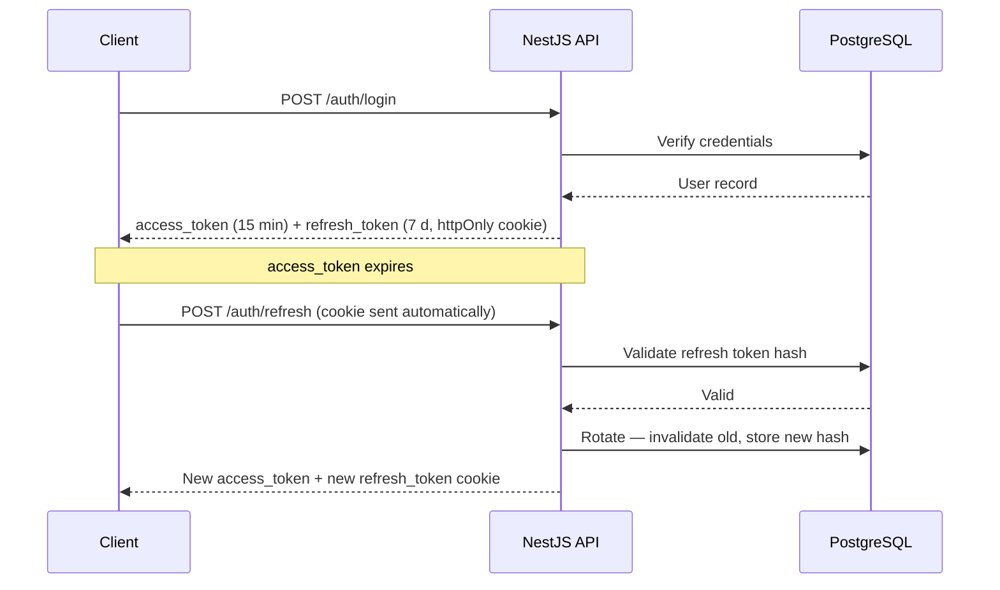
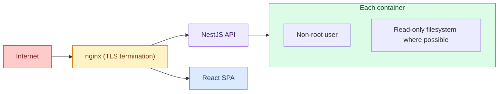

# Security Policy

---

## Reporting a Vulnerability

Do not open a public GitHub issue for security vulnerabilities.

Report privately by contacting the Tech Lead or Project Manager via Discord DM. Include:

- What the vulnerability is and where it is in the codebase
- Steps to reproduce
- What an attacker could do with it
- A suggested fix if you have one

| Step | Deadline |
|------|----------|
| Acknowledgment | 24 hours |
| Initial assessment | 48 hours |
| Fix — critical severity | 1 week |
| Fix — medium severity | 2 weeks |

---

## Security Model

### Authentication

- JWT access tokens with short expiry and refresh token rotation on each use
- 42 OAuth 2.0 via the [official 42 API](https://api.intra.42.fr/apidoc) — authorization code flow
- bcrypt for password hashing, minimum 12 salt rounds
- Session invalidation on password change and on any detected anomaly

Token lifecycle:

### Authorization

- Route-level guards on every protected endpoint — no endpoint is public by default
- Role-Based Access Control (RBAC) — roles checked at the guard layer, never in the controller
- No authorization logic in DTOs or validators

### Data Protection

- All inputs validated via `class-validator` DTOs — no raw user data reaches the service layer
- Parameterized queries only — Prisma never interpolates user input into SQL
- No `dangerouslySetInnerHTML` in React — default escaping plus strict Content-Security-Policy headers via Helmet.js
- Secrets in environment variables — the `pre-commit` hook blocks `.env` files from being staged
- HTTPS in production — TLS 1.3, HSTS enforced, HTTP redirected

### Infrastructure

- Non-root user in all production containers
- Helmet.js: CSP, X-Frame-Options, X-Content-Type-Options, Referrer-Policy, HSTS
- Per-IP and per-route rate limiting on all public endpoints
- CORS restricted to known origins only

### Dependencies

- `pnpm audit` runs in the CI pipeline on every PR
- Lock files committed — reproducible installs, no silent version drift
- No wildcard version ranges — all dependencies pinned to exact or `~minor`

---

## Scope

This is a 42 school project. The following are explicitly out of scope:

- Formal penetration testing or security audit
- SOC 2, ISO 27001, or any compliance framework
- Bug bounty program
- 24/7 incident response

Security is taken seriously as a technical discipline, not as compliance theater. The practices above reflect what a production service at this scale actually needs.
